# Trading Application - Architecture Documentation

## System Architecture

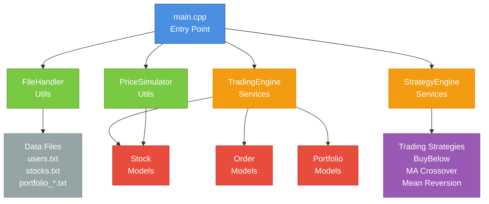

## Class Hierarchy

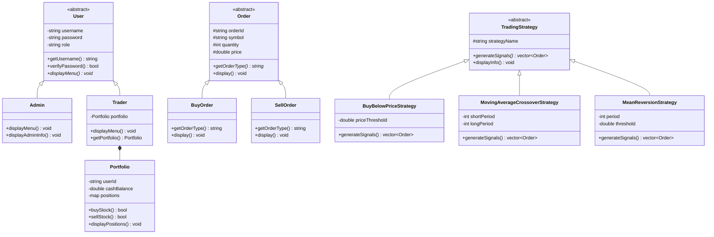

## Data Flow

### User Authentication Flow

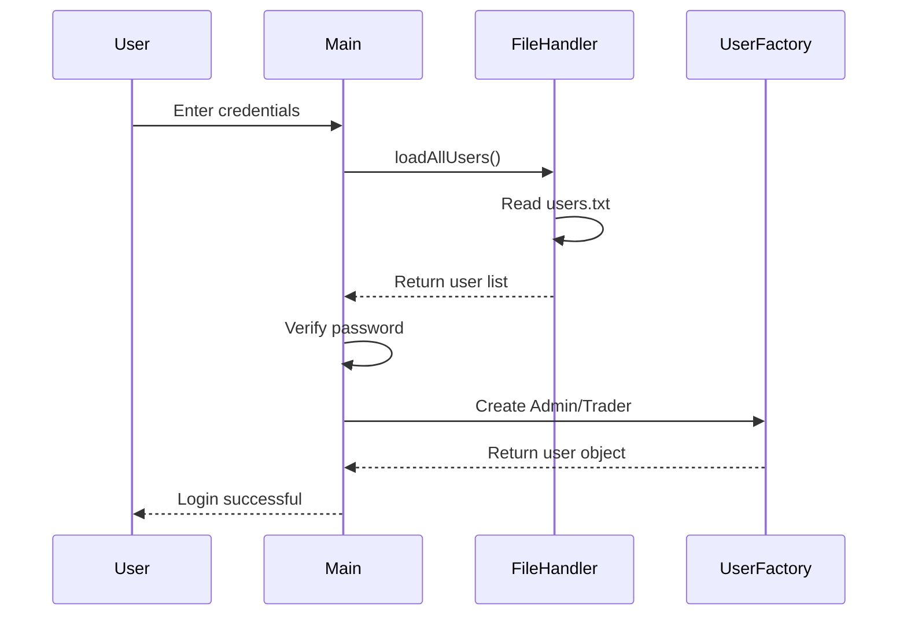

### Trading Flow (Trader)

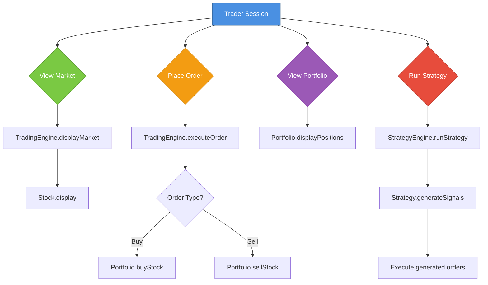

### Market Management Flow (Admin)

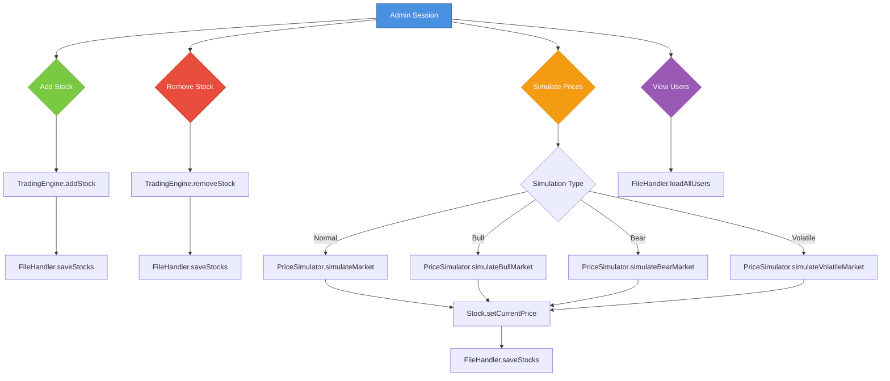

## Layered Architecture

```mermaid
graph TB
    subgraph Presentation["Presentation Layer"]
        UI[Console UI<br/>main.cpp<br/>Menus | Input | Output]
    end
    
    subgraph Business["Business Logic Layer"]
        TE[TradingEngine<br/>executeOrder<br/>addStock<br/>removeStock]
        SE[StrategyEngine<br/>runStrategy<br/>addStrategy]
        PS[PriceSimulator<br/>simulate<br/>update prices]
    end
    
    subgraph Models["Domain Model Layer"]
        Stock[Stock<br/>price<br/>history<br/>symbol]
        Order[Order<br/>symbol<br/>quantity<br/>price]
        Portfolio[Portfolio<br/>positions<br/>balance<br/>transactions]
        User[User<br/>credentials<br/>role]
    end
    
    subgraph Persistence["Persistence Layer"]
        FH[FileHandler<br/>save<br/>load<br/>serialize]
        Files[(Data Files<br/>users.txt<br/>stocks.txt<br/>portfolio_*.txt)]
    end
    
    UI --> TE
    UI --> SE
    UI --> FH
    
    TE --> Stock
    TE --> Order
    TE --> Portfolio
    
    SE --> Stock
    SE --> Order
    SE --> Portfolio
    
    PS --> Stock
    
    FH --> User
    FH --> Stock
    FH --> Portfolio
    FH --> Files
    
    style Presentation fill:#4a90e2,stroke:#2e5c8a,color:#fff
    style Business fill:#f39c12,stroke:#d68910,color:#fff
    style Models fill:#e74c3c,stroke:#c0392b,color:#fff
    style Persistence fill:#7ac943,stroke:#5a9633,color:#fff
```

## OOP Concepts Implementation

### Encapsulation

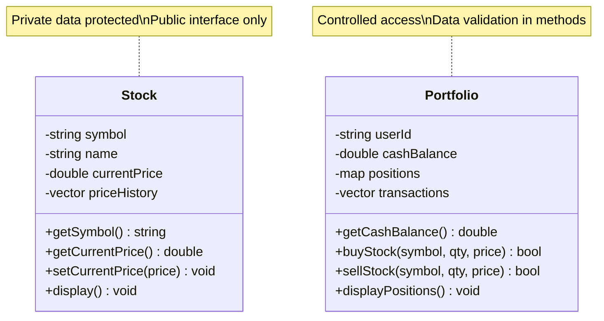

### Inheritance & Polymorphism

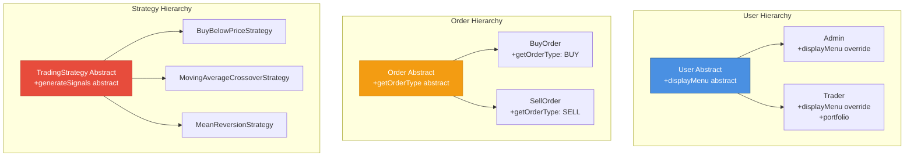

### Composition Relationships

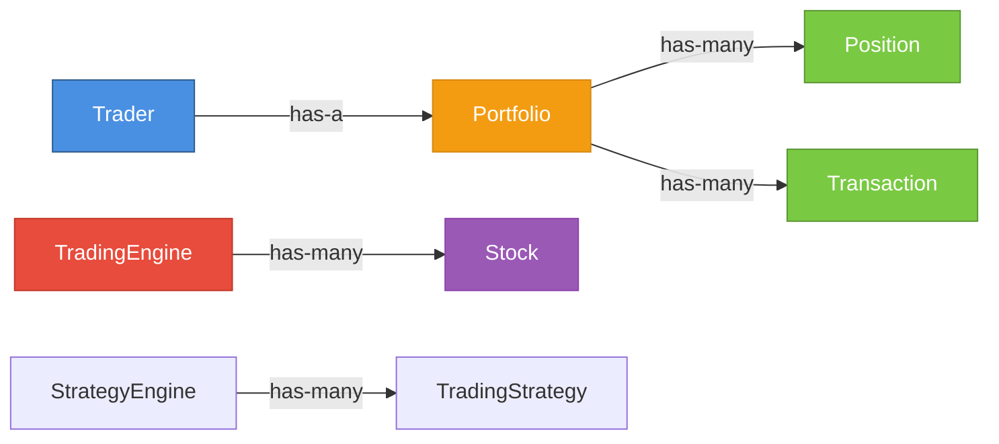

## Module Dependencies

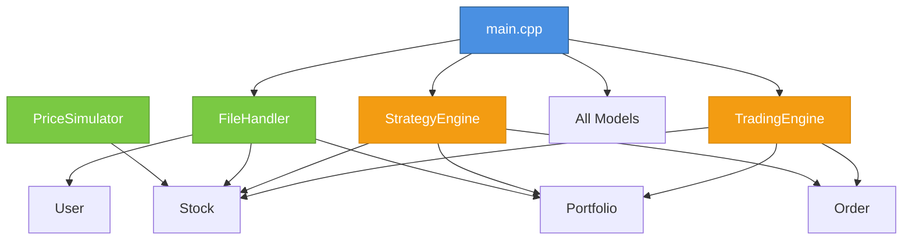

## Sequence Diagram: Execute Buy Order

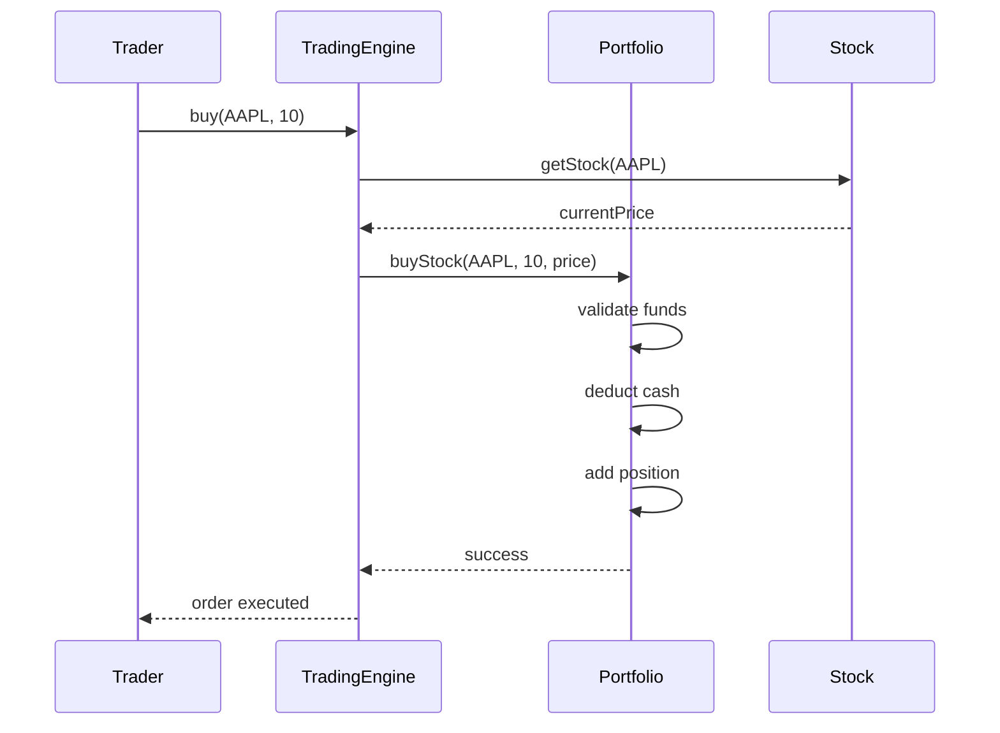

## File Structure

```mermaid
graph TD
    Root[trading-application/] --> Models[models/]
    Root --> Services[services/]
    Root --> Utils[utils/]
    Root --> Main[main.cpp]
    Root --> Data[data/]
    Root --> Docs[Documentation]
    
    Models --> Stock[Stock.h/cpp]
    Models --> Order[Order.h/cpp]
    Models --> Portfolio[Portfolio.h/cpp]
    Models --> User[User.h/cpp]
    
    Services --> TradingEngine[TradingEngine.h/cpp]
    Services --> StrategyEngine[StrategyEngine.h/cpp]
    
    Utils --> FileHandler[FileHandler.h/cpp]
    Utils --> PriceSimulator[PriceSimulator.h/cpp]
    Utils --> Colors[Colors.h]
    
    Data --> UsersFile[users.txt]
    Data --> StocksFile[stocks.txt]
    Data --> PortfolioFiles[portfolio_*.txt]
    
    Docs --> README[README.md]
    Docs --> QuickStart[QUICKSTART.md]
    Docs --> OOPConcepts[OOP_CONCEPTS.md]
    Docs --> Architecture[ARCHITECTURE.md]
    
    style Root fill:#4a90e2,stroke:#2e5c8a,color:#fff
    style Models fill:#e74c3c,stroke:#c0392b,color:#fff
    style Services fill:#f39c12,stroke:#d68910,color:#fff
    style Utils fill:#7ac943,stroke:#5a9633,color:#fff
    style Main fill:#9b59b6,stroke:#8e44ad,color:#fff
    style Data fill:#95a5a6,stroke:#7f8c8d,color:#fff
    style Docs fill:#3498db,stroke:#2980b9,color:#fff
```

## Complete Data Flow Summary

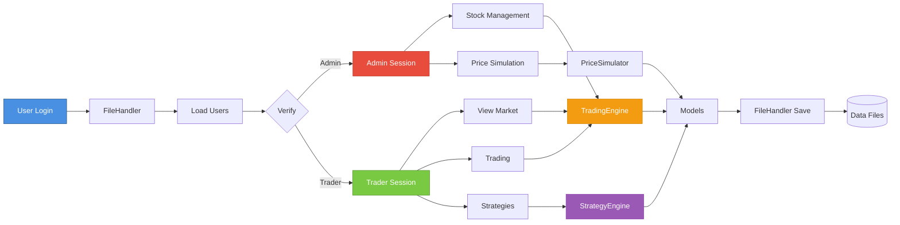
